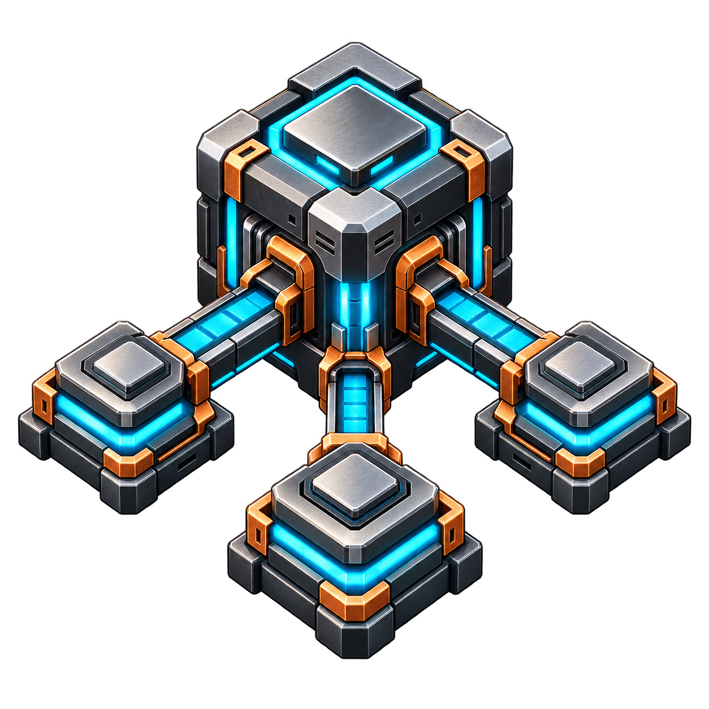
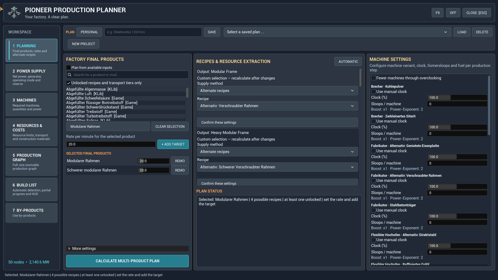
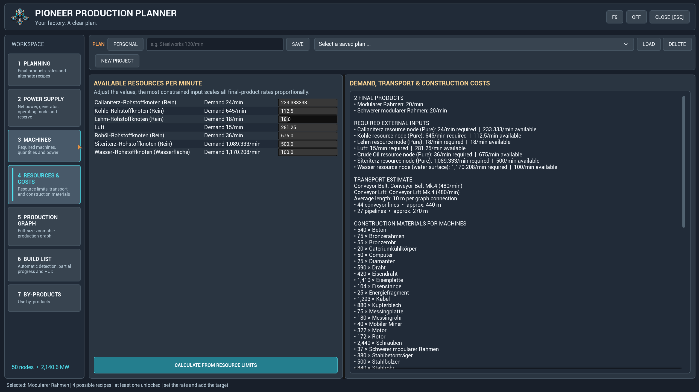
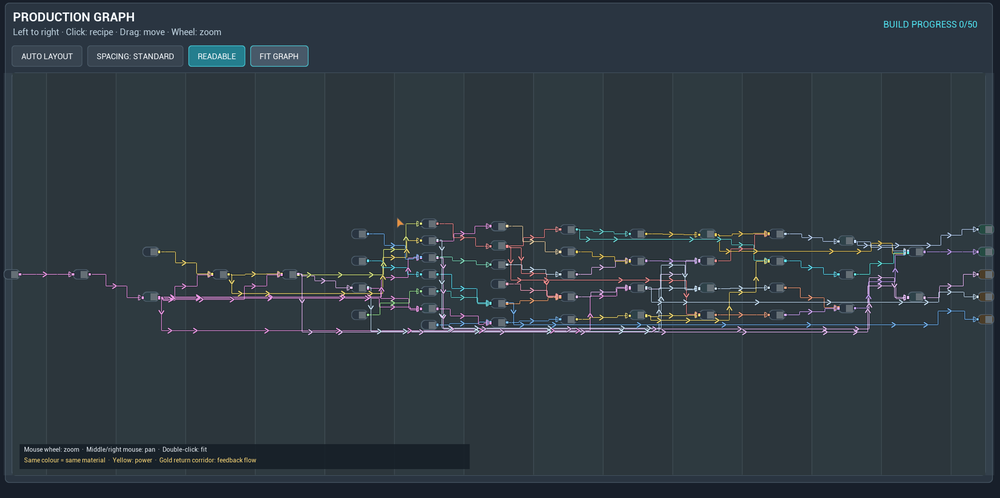
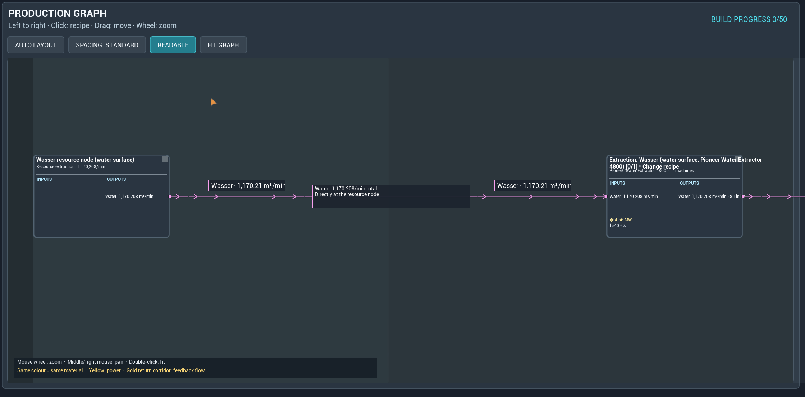
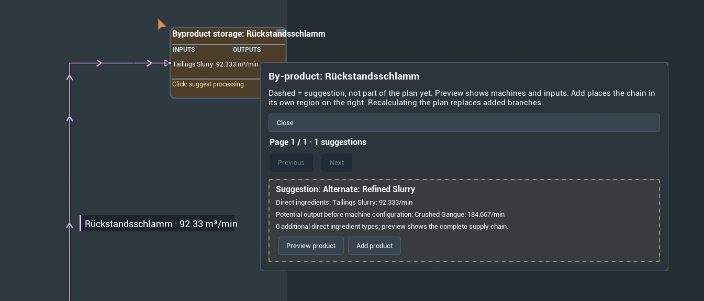
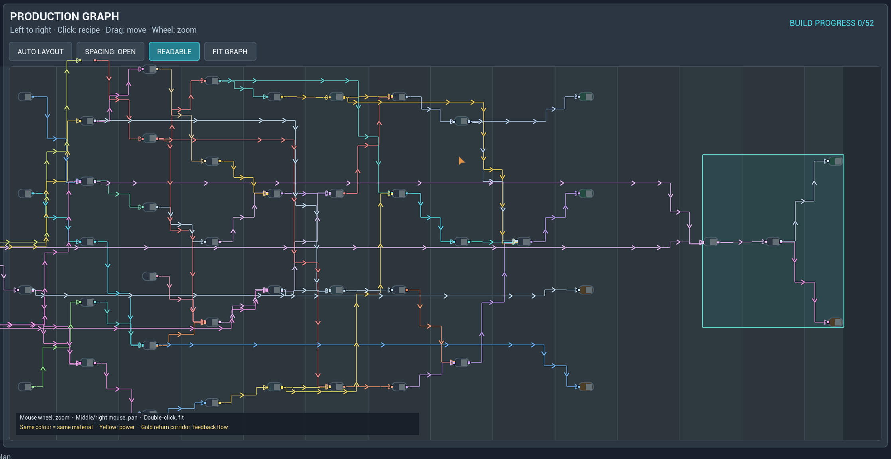
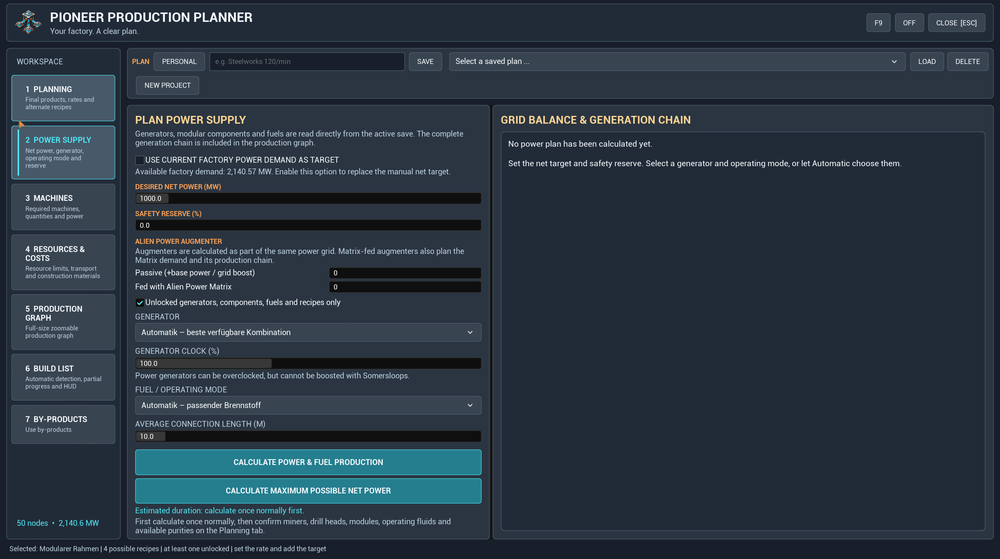
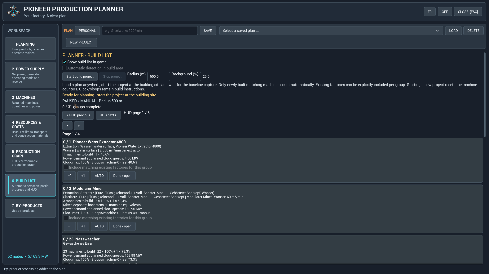

[English](README.md)

# Pioneer Production Planner

**Fabrik planen. Produktionswege verstehen. Direkt in Satisfactory bauen.**

Pioneer Production Planner verbindet Produktionsketten, Stromplanung und eine persönliche Bauliste direkt im Spiel. Lege deine Ziele fest, prüfe den Graphen und nutze Nebenprodukte für weitere Produktionsschritte.

**Version 1.7.3 · Deutsche und englische Oberfläche · Mod-Referenz: `SFPFactoryPlanner`**

## Neu in 1.7.3

- Überarbeitete Oberfläche mit fester linker Navigation, einheitlichen Bedienelementen und neuem Logo.
- Rezepte direkt an den Maschinenkarten im Graphen ändern. Eingänge, Ausgänge und Nebenprodukte pro Minute vor dem Übernehmen und Neuberechnen prüfen.
- Durchgehender Graph von links nach rechts mit normalem oder großzügigem Abstand. **Lesbar** zeigt den Anfang bei sinnvoller Vergrößerung; **Fit Graph** zeigt den gesamten Plan.
- Gespeicherte persönliche Ansichten und Abstände. Beim Rezeptwechsel bleiben Zoom und Fokus soweit möglich erhalten. Schlägt die Berechnung fehl, bleibt der bisherige Plan bestehen.

## Nach deinen Zielen planen

Plane mehrere Produkte gemeinsam oder berechne die Produktion anhand verfügbarer Ressourcen. Prüfe Maschinenanzahl, Takt, Strombedarf und Baumaterialien. Wähle alternative Rezepte, nutze den Freischaltungsfilter und passe die Produktionsverstärkung an, sofern unterstützt.

Die Transporteinstellungen umfassen Förderbänder, Lifte und Pipelines. Kompatible Stufen werden aus dem laufenden Spiel ermittelt. Die Transportangaben sind Planungsschätzungen und keine Vermessung bereits gebauter Strecken.

## Jeden Produktionsschritt verstehen

Verfolge Materialflüsse von links nach rechts, vergrößere einzelne Maschinenkarten und ordne die Ansicht passend zu deiner Fabrik an. Die Rezeptvorschau zeigt Mengen für den aktuellen Bedarf des ausgewählten Schritts einschließlich Maschinenanzahl und Takt.

Ein übernommenes Rezept wird zur manuellen Vorgabe für dieses Produkt im gesamten Plan. Anschließend wird die Produktionskette neu berechnet.

## Nebenprodukte sinnvoll verwerten

Wähle ein Nebenprodukt im Graphen oder öffne den Bereich für Nebenprodukte, um passende Weiterverarbeitungsrezepte zu entdecken. Prüfe einen Vorschlag und füge anschließend einen Produktionszweig hinzu. Für kompatible Brennstoffe lassen sich auch Zweige zur Stromerzeugung ergänzen.

Vorschläge und hinzugefügte Verarbeitungszweige werden optisch getrennt dargestellt. So bleiben die ursprüngliche Produktionskette und ihre Erweiterungen erkennbar.

Ergänzte Zweige werden über die Nebenproduktauswahl geändert; ihr Rezeptdialog im Graphen dient zur Ansicht. **Eine Neuberechnung des Hauptplans ersetzt angehängte Zweige.** Benannte gespeicherte Pläne behalten die darin enthaltenen Zweige.

## Stromversorgung mitplanen

Wähle Generatoren und Brennstoffe, lege die gewünschte Nettoleistung und Reserve fest oder übernimm den berechneten Fabrikbedarf. Berücksichtige die Brennstoffproduktion und deren Eigenverbrauch und berechne die maximal mögliche Nettoleistung unter den gewählten Bedingungen.

## Im eigenen Tempo bauen

Die persönliche Bauliste erfasst Teilfortschritte und bietet manuelle Korrekturen, Erledigt-Markierungen sowie ein optionales transparentes HUD. Die HUD-Seiten werden manuell gewechselt: Du bestimmst, welcher Abschnitt sichtbar bleibt.

Lade oder berechne deinen Plan jederzeit. **Starte das Bauprojekt erst am tatsächlichen Bauplatz**, damit die vorhandenen Maschinen als Ausgangsbestand erfasst werden. Die automatische Erkennung zählt danach passende neue Maschinen im gewählten Bereich. Vorhandene Maschinen lassen sich ausdrücklich einbeziehen. Abrisse und manuelle Korrekturen ermöglichen Anpassungen während des Baus.

Der Baufortschritt gilt pro Spieler, auch bei gemeinsam genutzten Planentwürfen. Die Erkennung zählt Gebäude; Takt und Produktionsverstärkung bleiben Einstellungen, die du selbst an den Maschinen vornehmen musst.

## Erste Schritte

1. Installiere Pioneer Production Planner über den Satisfactory Mod Manager.
2. Öffne den Planner mit deinem eingestellten Tastenkürzel oder mit `/sfpplanner open` im Chat. Mit `/sfpplanner hotkey reset` stellst du bei Bedarf das Standardkürzel wieder her.
3. Wähle Produkte und Mengen, prüfe Rezepte und Einstellungen und starte die Berechnung.
4. Kontrolliere Graph, Ressourcen und Strombedarf. Speichere deinen Plan.
5. Starte das Bauprojekt am Bauplatz und blende bei Bedarf das HUD ein.

**Neues Projekt** setzt den aktuellen Arbeitsplan zurück. Benannte gespeicherte Pläne und gemeinsam genutzte Pläne bleiben erhalten.

## Kompatibilität und Hilfe

Rezepte und kompatible Maschinendaten werden aus dem laufenden Spiel gelesen. Die Screenshots zeigen auch Inhalte anderer Mods, darunter Satisfactory Plus. Diese sind Beispiele und nicht für jeden Plan erforderlich. Die Unterstützung hängt von den Daten der jeweiligen Mod ab. Von Mods gelieferte Gegenstandsnamen können in ihrer ursprünglichen Sprache bleiben.

Im Mehrspielermodus müssen Clients und Server dieselbe Version **1.7.3** verwenden. Planentwürfe können geteilt werden; persönliche Ansichten und Baufortschritte bleiben beim jeweiligen Spieler.

Ein Problem gefunden? [Erstelle ein Issue](https://github.com/DerDoesewicht/PioneerProductionPlanner/issues) mit Mod-Version, installierten Mods, Schritten zur Reproduktion und nach Möglichkeit einem Screenshot oder Log.

## Entwicklung

Die Entwicklung erfolgte mit KI-Unterstützung. Das neue Logo wurde mit KI erstellt. Die Screenshots zeigen die Oberfläche im Spiel.
