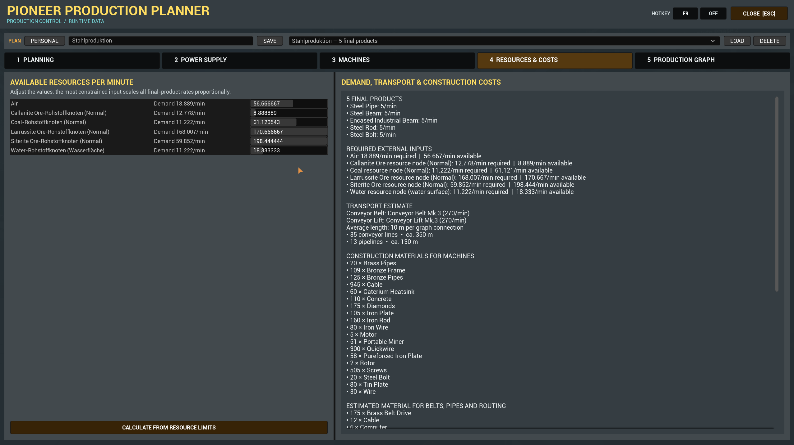

# Pioneer Production Planner

> Plan production from your target outputs or available inputs — directly inside Satisfactory.

[](screenshots/1-Planung.png)

Pioneer Production Planner is an in-game factory and power planner for Satisfactory. It reads recipes, machines, unlocks and transport tiers from the currently loaded save and turns them into a production plan with material flows, machine counts and construction estimates.

Plan the products you want to make, or enter the resources you already have and calculate the output your selected recipe chains can support.

The planner supports Vanilla content and compatible modded recipe sets. Satisfactory Plus, KAPI and KLib are optional integrations, not required dependencies. The screenshots below show a Satisfactory Plus factory.

## Plan your production

### Start with target products

Choose multiple final products and set an independent target rate for each one. Shared intermediate products are combined into one factory plan.

Use the compact product search to add targets. Conveyor belt, conveyor lift and average connection-length settings are available under **More settings**.

### Start with available inputs

Enable **Plan from available inputs** and enter your available supply as a number of lines and a rate per line — for example, **2 × 150 Siterite Ore/min**.

Add the products you want to make and calculate:

- Free outputs increase together at an equal rate per minute.
- Editing an output rate makes it a fixed request.
- Recalculate to distribute the remaining capacity among the free outputs.
- Release a fixed request to let that product scale again.
- If fixed requests exceed the available supply, the planner reports the shortfall instead of silently reducing them.

The maximum applies to the **selected recipe chains**. Additional required resources are listed separately; they must also be supplied to achieve the calculated output.

### Choose recipes and resource sources

The **Recipes & Resource Extraction** panel shows choices relevant to the production chain.

Select standard recipes, alternative recipes, conversion or direct extraction where available. For extraction, check the source, miner and node purity. Compatible modular miners also expose supported mining heads, processing modules and operating fluids.

The panel distinguishes the requested **output** from the **raw resource at the input**. A processed output may require a processing module; choose a separate production recipe if you want to mine raw ore and process it in another machine.

Automatic selections are starting assumptions. Review them against the equipment and resource nodes you intend to use, then confirm and recalculate.

## Follow the production graph

[](screenshots/Graphenansicht-1.png)

Explore the chain from resource sources to final products in a zoomable, pannable graph.

- Direction arrows show where materials move, including return flows.
- Material colors and separate connection ports help trace individual streams.
- Splitters, mergers and pipeline junctions show the planned routing.
- Parallel transport lines continue from producers to consumers.
- Completion checkboxes let you track construction within each plan.

### Inspect machines and individual routes

[](screenshots/Graphenansicht-2.png)

Zoom in to see material names and rates along the routes, transport details and machine settings. Machine nodes show whole machines to build and the clock-speed split, including the final underclocked machine.

The calculation accounts for shared by-products and return flows in the selected chain. Production loops may still need startup material, buffers and controlled return-flow handling.

## Review the machine list

[](screenshots/Uebersicht.png)

The **Machines** tab summarizes final products, machine counts, base power demand and routing buildings. Use the branch-by-branch list to see which machines to build and how to clock them.

## Check resources and construction costs

[](screenshots/Resources.png)

The **Resources & Costs** tab brings together external input demand, resource availability and construction estimates.

Review required materials for machines, belts, pipes and routing buildings. For target-based plans, resource limits can scale all final-product rates proportionally. For plans started from available inputs, edit the inputs and fixed output requests in the **Planning** tab.

## Plan power supply

[](screenshots/Stromrechner.png)

Set the desired **net power output** and a safety reserve. Choose an available generator and fuel or operating mode, or use automatic selection.

Power planning includes the generation chain, fuel production and its own power consumption. Available generators, components and fuels are read from the active save.

## Save plans and track progress

Save named plans and restore the last active plan. Available-input settings and fixed output requests are saved with input-based plans.

Personal plans remain local. Community plans support server-synchronized planning and construction progress. Completed nodes belong to their plan, so a different plan starts with its own progress.

## Getting started

1. Install Pioneer Production Planner through Satisfactory Mod Manager.
2. Load a save and complete the **Factory Planner Terminal** milestone in HUB Tier 1.
3. Build the floor-standing terminal for **10 Iron Plates** and **20 Cable**.
4. Interact with it using the normal Use key.
5. Choose target-based planning or enable **Plan from available inputs**, configure your products and calculate.

[](screenshots/Modterminal.png)

You can also open the planner with its configurable hotkey. The default is **F8**; the screenshots use **F9**. Change or disable the hotkey in the planner header.

Available chat commands:

```text
/sfpplanner open
/sfpplanner close
/sfpplanner export
/sfpplanner hotkey F9
/sfpplanner hotkey off
/sfpplanner hotkey reset
```

The interface follows the game language: German for German language settings and English otherwise.

## Compatibility

| Component | Support |
| --- | --- |
| Satisfactory | Game build `>=502094` |
| Satisfactory Mod Loader | `^3.12.0` required |
| Vanilla recipes and standard miners | Supported |
| Compatible content mods | Read dynamically at runtime |
| Satisfactory Plus | Optional |
| KAPI / KLib Modular Miner integration | Optional |
| Multiplayer / dedicated servers | Matching planner version required on clients and server |
| Interface languages | English and German |

The unlock filter follows the currently loaded save. Optional mod content appears when the mod and its supported runtime data are available.

## Planning notes

The graph is a logical production plan, not a three-dimensional factory blueprint. Transport lengths and construction costs are estimates based on the selected average connection length. Actual routes, slopes and factory geometry may require different amounts.

Calculated output depends on the selected recipes, configured sources and a continuous supply of all required inputs. Input-based planning maximizes free outputs within the selected chains; it does not search every possible recipe combination for a global optimum.

## Support and bug reports

Please use [GitHub Issues](https://github.com/DerDoesewicht/PioneerProductionPlanner/issues) for reproducible bugs and feature requests.

Include:

- Game build, SML version and Pioneer Production Planner version.
- Installed content mods.
- Exact reproduction steps and expected behavior.
- Screenshots of the affected settings or graph.
- A runtime export from `/sfpplanner export` for missing recipes, miners or incorrect calculations.
- Relevant game logs or a crash report.

Discord: `derdoesewicht`

## Mod identity

- Public name: **Pioneer Production Planner**
- Technical mod reference: `SFPFactoryPlanner`

This project is not affiliated with or endorsed by Coffee Stain Studios.
