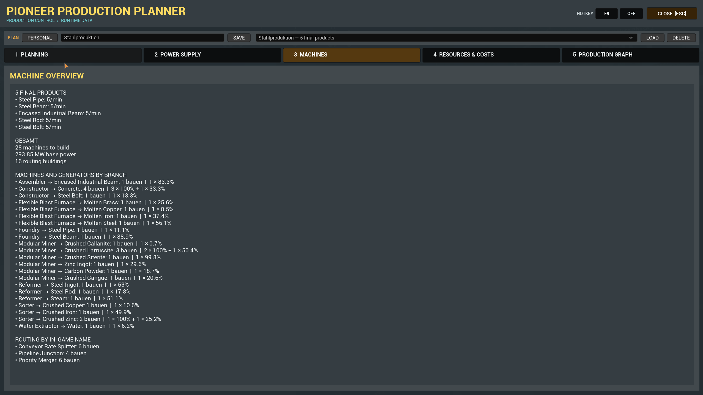
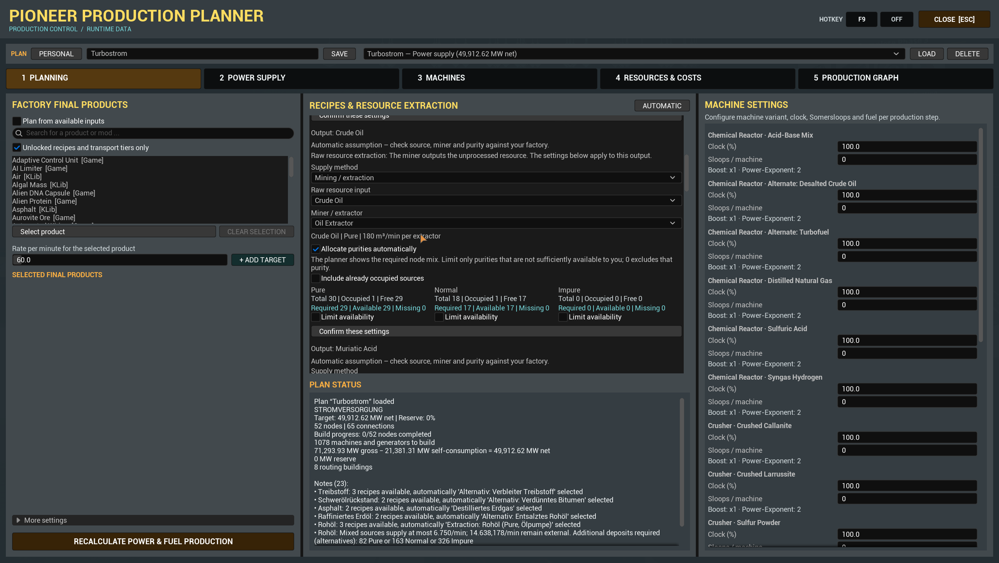
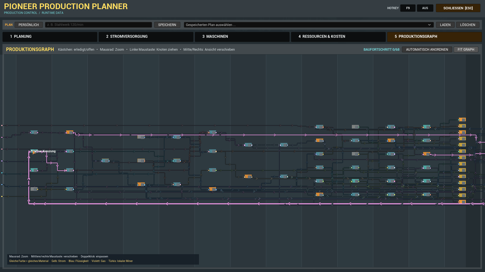
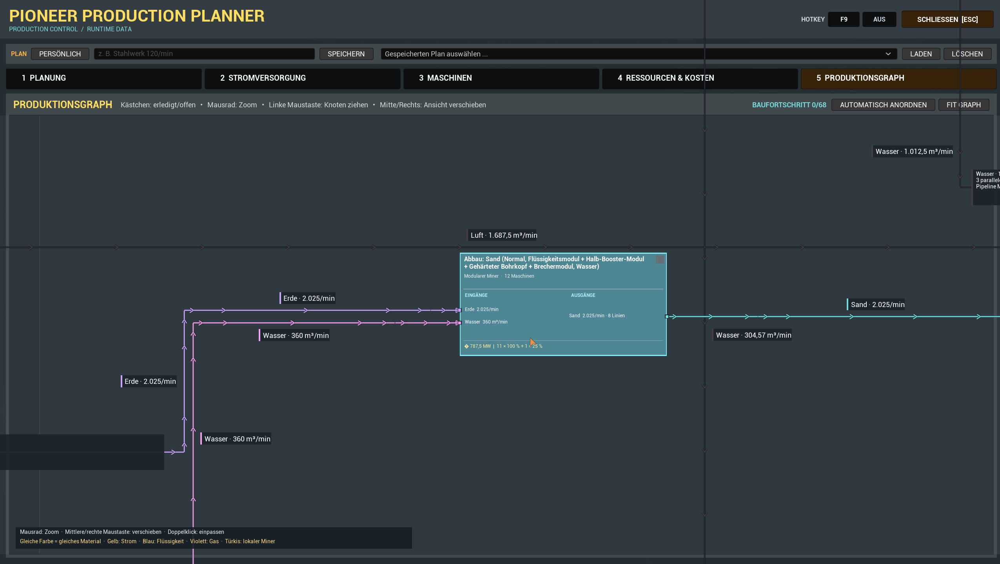
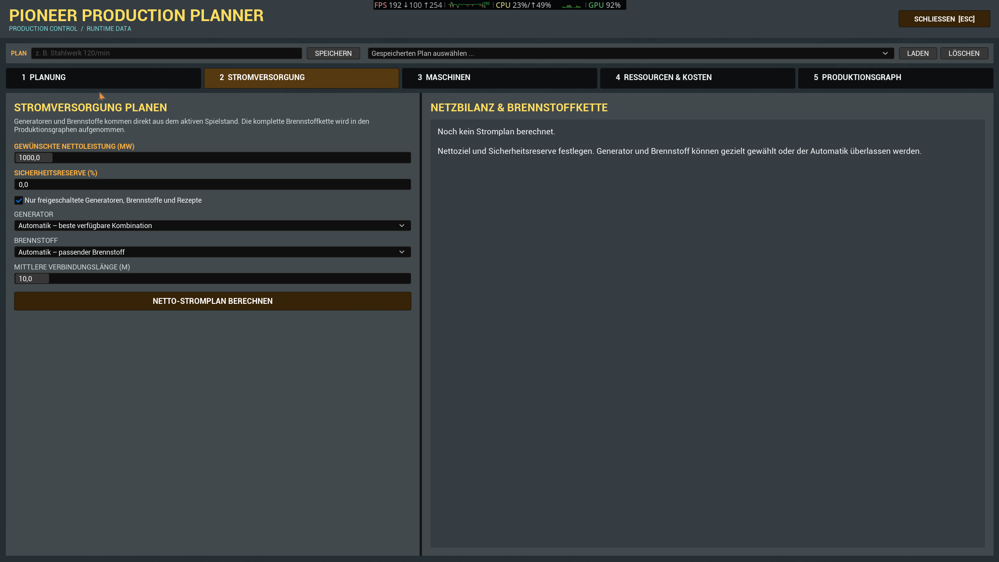
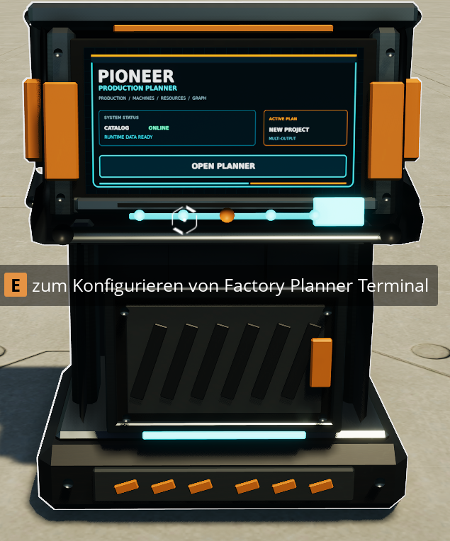

# Pioneer Production Planner

> Plan complete production and power systems directly inside Satisfactory.



Pioneer Production Planner is an in-game factory planner for Satisfactory. It uses the recipes, machines, unlocks and transport tiers available in the currently loaded save and turns them into a readable production plan.

The planner works with Vanilla content and compatible modded recipe sets. Satisfactory Plus, KAPI and KLib are optional integrations and are not required dependencies.

## Features

- Plan multiple end products with an independent target rate for every product.
- Combine shared intermediate products into one coherent factory plan.
- Select recipes automatically or override individual production steps.
- Display whole machines to build, including the exact clock-speed split for the final underclocked machine.
- Read available recipes and transport tiers from the currently loaded save.
- Select conveyor belts and conveyor lifts separately.
- Keep parallel transport lines continuous from producer to consumer.
- Add splitters and mergers only when the real routing topology requires them.
- Calculate raw inputs, by-products, machine power, resource limits and construction costs.
- Plan fuel-based power production from a requested net output, including fuel chains, self-consumption and reserve capacity.
- Explore the complete production chain in a zoomable graph with persistent completion checkboxes.
- Save named plans and automatically restore the last active plan.
- Use the interface in English or German according to the game language.

## Screenshots

### Multi-product planning

[](screenshots/1-Planung.png)

### Readable production graph

[](screenshots/Graphenansicht-1.png)

[](screenshots/Graphenansicht-2.png)

### Power production planning

[](screenshots/Stromrechner.png)

### In-game planner terminal

[](screenshots/Modterminal.png)

## Getting started

1. Install Pioneer Production Planner through Satisfactory Mod Manager.
2. Load a save and complete the **Factory Planner Terminal** milestone in HUB Tier 1.
3. Build the floor-standing terminal for **10 Iron Plates** and **20 Cable**.
4. Interact with the terminal using the normal Use key.

You can also press **F8** after loading a save.

Available chat commands:

```text
/sfpplanner open
/sfpplanner close
/sfpplanner export
```

## Compatibility

| Component | Support |
| --- | --- |
| Satisfactory | Game build `>=502094` |
| Satisfactory Mod Loader | `^3.12.0` required |
| Vanilla recipes | Supported |
| Compatible content mods | Read dynamically at runtime |
| Satisfactory Plus | Optional |
| KAPI / KLib Modular Miner integration | Optional |
| Interface languages | English and German |

The unlock filter follows the currently loaded save. Content from an optional mod appears only when that mod and its runtime data are available.

## Planning notes

The production graph is a logical production plan, not a three-dimensional factory blueprint. Transport lengths and construction costs are estimates based on the average connection length selected by the player. Actual routes, slopes and factory geometry may require different amounts.

## Support and bug reports

Please use [GitHub Issues](https://github.com/DerDoesewicht/PioneerProductionPlanner/issues) for reproducible bugs and feature requests.

Include the following information in bug reports:

- game build
- SML version
- Pioneer Production Planner version
- installed content mods
- exact reproduction steps
- relevant game log or crash report

Discord: `derdoesewicht`

## Mod identity

- Public name: **Pioneer Production Planner**
- Technical mod reference: `SFPFactoryPlanner`

This project is not affiliated with or endorsed by Coffee Stain Studios.
