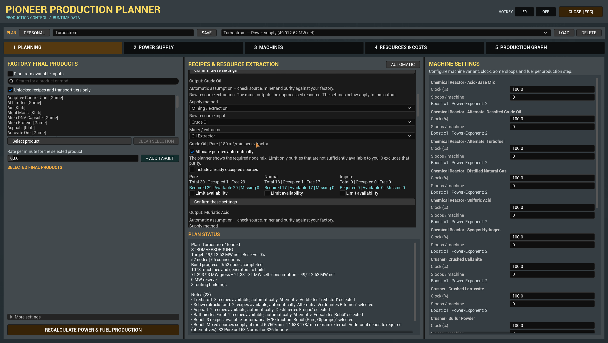
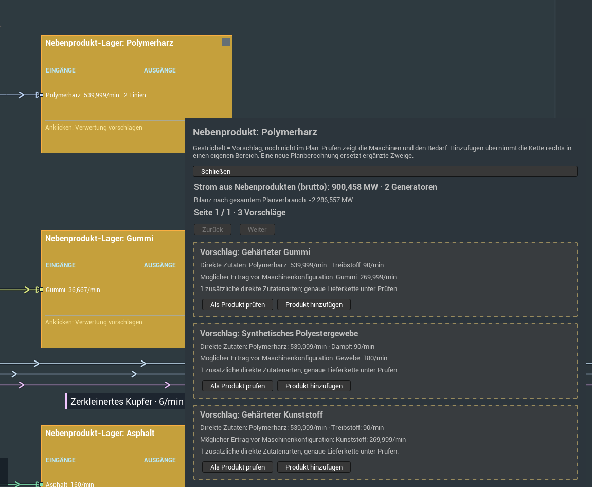
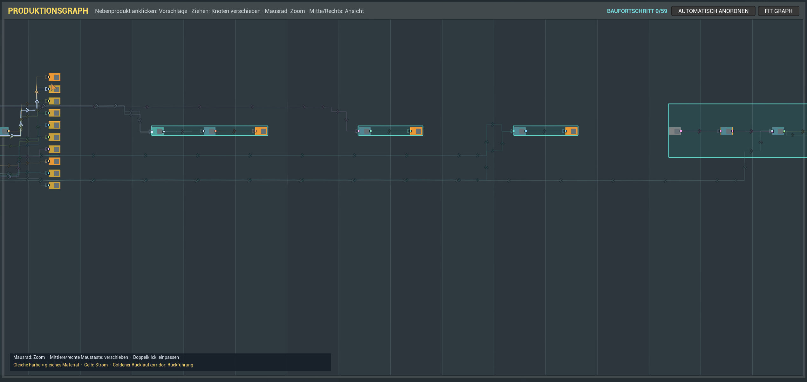
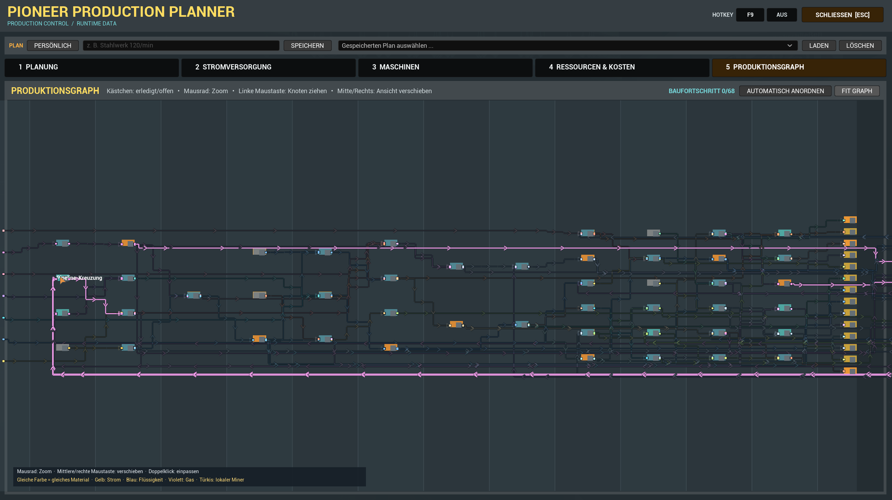
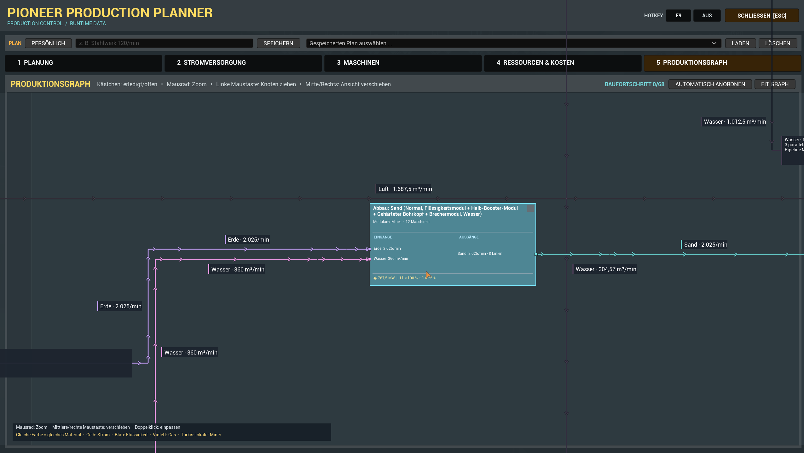
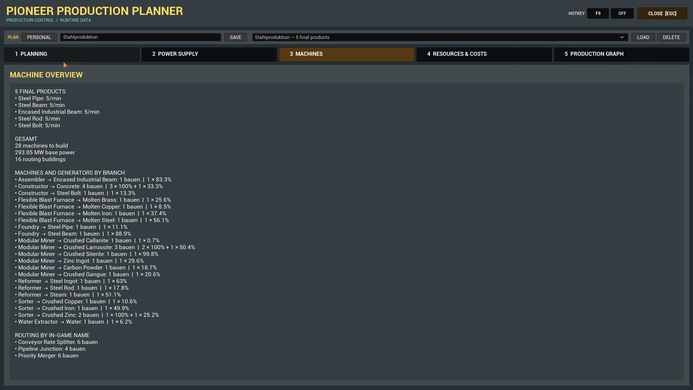
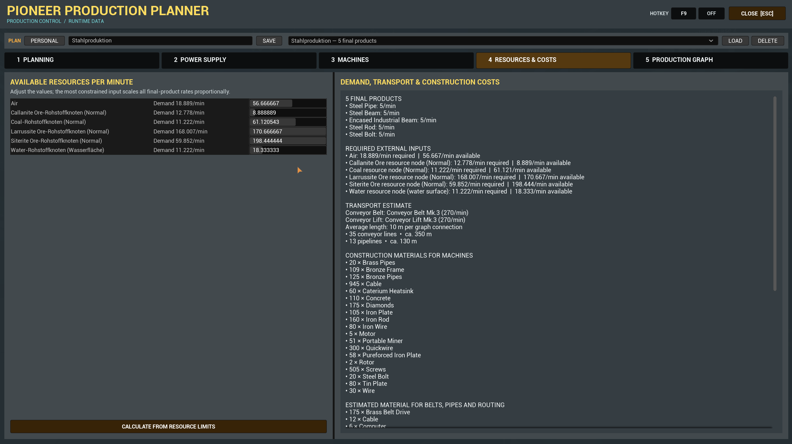
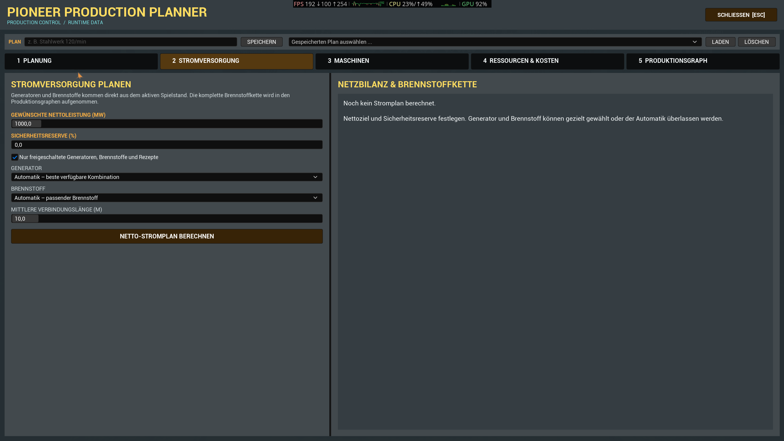

# Pioneer Production Planner

> Plan your factory from the products you want — or the resources you already have.

## English

Pioneer Production Planner is an in-game production and power planner for Satisfactory. It reads recipes, machines, unlocks and transport tiers from your loaded save and combines them into a complete production chain.

Plan several products together, configure extraction and recipes, check machine counts, clock speeds and fuel demand, and follow every step in a zoomable production graph.

## Pioneer Production Planner 1.7.0

### New in 1.7.0: put by-products to work

Click a by-product directly in the graph to see unlocked processing recipes for that material. Dashed cards clearly mark suggestions that are not yet part of your plan.

- **Preview product** shows the additional machines, resources and power demand.
- **Add product** adds the processing chain directly.
- **Add power** plans compatible fuel production through to generators, for example **Heavy Oil Residue → Fuel → Power**.
- Added chains appear in separate labelled regions on the right, connected to the original production. Adding from the graph menu focuses the new region.
- **Tab 7 — By-products** provides a searchable list with manual pagination.
- Existing production is preserved. Only unused surplus is consumed, and shared resource limits are checked before adding a chain.

### Pipelines and extraction

Choose **Automatic** or a specific available pipeline tier under **More settings**. Vanilla and compatible modded pipes are read from runtime data, including **Pioneer Pipelines Mk.5 — 1200 m³/min**. Higher demand is distributed across parallel lines. The selection is saved with the plan and also applies to power planning and by-product processing.

Pioneer Pipelines Oil Extractor 1200 is recognized with its building data, purity and clock speed. Resource planning can use automatic purity mixes and available deposit counts, with manual adjustments.

### Personal build checklist

The transparent checklist shows required machines and partial progress. Calculate or load a plan, then start your personal build project at the intended building site. Existing machines are recorded as the baseline; nearby factories are not automatically counted as new construction. Existing machines can be included explicitly.

- Automatic tracking of construction and dismantling, with manual corrections.
- Progress belongs to each player, including in multiplayer.
- Hide the checklist whenever you want; switch pages manually.
- Checklist ordering follows the graph from left to right.

### Machines and power planning

- Select compatible machine variants for every production step.
- Configure clock speed and Somersloops per machine group; the final machine is underclocked to match demand.
- Plan compatible fuel-powered production machines using their runtime fuel classes and energy values.
- Calculate generator overclocking, complete fuel chains and Alien Power Augmenters as part of the net-power plan.
- BurnerManufacturer support remains optional and does not add a hard dependency on that mod.

### Miners and Satisfactory Plus

- Vanilla Miner Mk.1, Mk.2 and Mk.3 are discovered from the active runtime data.
- Vanilla miners and S+ Modular Miner routes are separated per resource, even when S+ reuses a Vanilla descriptor.
- Raw S+ extraction supports Standard, Hardened or Diamond Mining Heads without forcing a processing module.
- Smelter, Crusher and other processing modules are required only for outputs that actually use them.
- For every immediate S+ ore stage, the raw-resource and miner controls are grouped into the corresponding processing card.

### Production graph

- Rebuilt around a clear left-to-right factory flow with aggregated machine groups.
- Individual material ports, deterministic route colours and aggregate rates make large plans easier to trace.
- Splitters, mergers, storage endpoints and repeated route labels expose the complete material path.
- Feedback from refineries and mod recipes uses dedicated lanes above the production stages.
- A gold return corridor and **↩ RETURN FLOW** labels clearly mark cycles while material colours remain intact.
- Zoom reaches 5%; **FIT GRAPH** and double-click can frame the complete graph.
- Long headings wrap, while zoom-dependent detail levels keep overview scales readable.
- Route names, headings, input/output labels and navigation help follow the active game language. Existing saved S+ plans resolve current item names from the live runtime descriptors.

### Main features

- Multiple final products with individual rates.
- Shared intermediate production and by-product accounting.
- Automatic recipe selection with manual overrides.
- Resource source, miner, purity, module and operating-fluid settings where supported.
- Whole-machine counts with clock-speed allocation and per-group machine configuration.
- Separate belt, lift and pipeline tiers, resource limits and construction-cost estimates.
- Net-power planning with fuel chains, self-consumption and reserve settings.
- Three-column planning workflow for targets, recipes/resources and machine settings.
- Interactive graph with material/rate labels and build-progress checkboxes.
- Saved personal plans and shared community plans on supported multiplayer setups.
- English and German interface.

### How to choose machine variants

1. Set final products or available inputs.
2. Calculate the plan once.
3. Open **More settings → Production machines** and select a compatible variant.
4. Recalculate and save.

These settings apply to the current plan. The unlock filter controls which variants are offered. Miner modules remain under resource extraction settings.

Faster machines can reduce building counts without reducing total power demand when speed and power increase proportionally.

### Getting started

Install through Satisfactory Mod Manager, load your save and press **F8** by default. Change or disable the hotkey in the planner header.

You can also unlock the **Factory Planner Terminal** in HUB Tier 1, build it for **10 Iron Plates and 20 Cable**, and use it to open the planner.

Chat commands: `/sfpplanner open`, `/sfpplanner close`, `/sfpplanner export`.

### Compatibility and planning notes

Vanilla is supported. Satisfactory Plus, KAPI/KLib, Industrial Evolution and BurnerManufacturer are **optional**, not mandatory dependencies. Compatible mod content is read at runtime; support depends on the data each mod exposes.

Input planning works with the selected recipe chains, not every possible recipe combination. The graph is a logical plan; transport lengths and construction costs are estimates. Variable-power totals use approximate cycle averages, so actual peaks can be higher.

Client and multiplayer server must both use **1.7.0**.

**Saved plans:** Saving and loading preserves added processing chains. Explicit recalculation rebuilds the original target plan and replaces those additions. Older plans remain loadable; extensions saved before the new grouping was introduced need to be added again to receive separate processing regions.

By-product power search considers up to eight steady, nonmodular generator variants at 100% clock. It finds a feasible proposal, not a guaranteed global maximum. Direct catalyst-return recipes are excluded from suggestions.

---

## Deutsch

Pioneer Production Planner ist ein Produktions- und Stromplaner direkt in Satisfactory. Er liest Rezepte, Maschinen, Freischaltungen und Transportstufen aus deinem geladenen Spielstand und erstellt daraus eine vollständige Produktionskette.

Plane mehrere Endprodukte gleichzeitig, wähle Rezepte und Rohstoffquellen, prüfe Maschinenanzahl, Taktung und Brennstoffbedarf und verfolge die einzelnen Schritte im zoombaren Produktionsgraphen.

## Pioneer Production Planner 1.7.0

### Neu in 1.7.0: Nebenprodukte sinnvoll verwerten

Klicke ein Nebenprodukt direkt im Graphen an, um passende freigeschaltete Verwertungsrezepte zu sehen. Gestrichelte Karten kennzeichnen Vorschläge, die noch nicht zum aktiven Plan gehören.

- **Als Produkt prüfen** zeigt zusätzliche Maschinen, Rohstoffe und Leistungsbedarf.
- **Produkt hinzufügen** übernimmt die Verarbeitung direkt.
- **Strom hinzufügen** plant bei passenden Brennstoffen die Kette bis zum Generator, beispielsweise **Schwerölrückstand → Treibstoff → Strom**.
- Ergänzte Ketten erscheinen rechts in eigenen beschrifteten Bereichen mit Verbindung zur Hauptproduktion. Nach dem Hinzufügen aus dem Graph-Menü wird der neue Bereich angezeigt.
- **Tab 7 — Nebenprodukte** bietet eine durchsuchbare Liste mit manueller Seitenauswahl.
- Bestehende Produktion bleibt erhalten. Nur freie Überschüsse werden verwendet; gemeinsame Rohstoffgrenzen werden vor der Übernahme geprüft.

### Pipelines und Rohstoffgewinnung

Unter **Weitere Einstellungen** kannst du **Automatisch** oder eine konkrete verfügbare Pipeline-Stufe wählen. Vanilla- und kompatible Mod-Rohre werden über ihre Laufzeitdaten erkannt, einschließlich **Pioneer Pipelines Mk.5 — 1200 m³/min**. Bei höherem Bedarf werden parallele Leitungen berechnet. Die Auswahl wird gespeichert und gilt auch für Stromplanung und Nebenprodukt-Verarbeitung.

Die Pioneer-Pipelines-Ölförderpumpe 1200 wird mit ihren Gebäudedaten, Reinheit und Takt berücksichtigt. Für Rohstoffquellen stehen automatische Reinheitsmischungen und verfügbare Vorkommen mit manuellen Anpassungen zur Verfügung.

### Persönliche Bauliste

Die transparente Bauliste zeigt benötigte Maschinen und Teilfortschritte. Berechne oder lade einen Plan und starte dein persönliches Bauprojekt am gewünschten Bauort. Bereits vorhandene Maschinen werden als Ausgangsbestand erfasst; benachbarte Fabriken zählen dadurch nicht automatisch als Neubauten. Vorhandene Maschinen können ausdrücklich einbezogen werden.

- Automatische Erfassung von Bau und Abriss sowie manuelle Korrekturen.
- Persönlicher Fortschritt pro Spieler, auch im Multiplayer.
- Bauliste jederzeit ausblendbar; Seiten werden manuell gewechselt.
- Die Reihenfolge folgt dem Graphen von links nach rechts.

### Maschinen und Stromplanung

- Kompatible Maschinenvarianten können für jede Produktionsstufe ausgewählt werden.
- Taktung und Somersloops werden pro Maschinengruppe konfiguriert; die letzte Maschine wird passend zum Bedarf untertaktet.
- Kompatible brennstoffbetriebene Produktionsmaschinen werden über ihre Laufzeit-Brennstoffklassen und Energieinhalte geplant.
- Generatorübertaktung, vollständige Brennstoffketten und Alien Power Augmenter fließen in die Nettostromplanung ein.
- BurnerManufacturer bleibt optional und wird nicht als feste Mod-Abhängigkeit eingetragen.

### Miner und Satisfactory Plus

- Vanilla Miner Mk.1, Mk.2 und Mk.3 werden aus den aktiven Laufzeitdaten erkannt.
- Vanilla Miner und S+-Modular-Miner-Routen werden pro Rohstoff getrennt, auch wenn S+ einen Vanilla-Deskriptor wiederverwendet.
- Reiner S+-Erzabbau unterstützt Standard, Hardened oder Diamond Mining Heads ohne erzwungenes Verarbeitungsmodul.
- Smelter-, Crusher- und andere Verarbeitungsmodule sind nur für Ausgaben erforderlich, die sie tatsächlich verwenden.
- Bei allen unmittelbaren S+-Erzstufen werden Rohstoff- und Miner-Auswahl in die zugehörige Verarbeitungskarte eingebettet.

### Produktionsgraph

- Klarer Factory-Flow von links nach rechts mit zusammengefassten Maschinengruppen.
- Eigene Materialports, deterministische Routenfarben und Gesamtmengen machen große Pläne nachvollziehbar.
- Splitter, Fusionatoren, Lagerziele und wiederholte Routenbeschriftungen zeigen den vollständigen Materialweg.
- Rückführungen aus Raffinerien und Mod-Rezepten laufen in eigenen Spuren oberhalb der Produktionsstufen.
- Ein goldener Korridor und **↩ RÜCKFÜHRUNG** markieren Kreisläufe eindeutig; die Materialfarben bleiben erhalten.
- Herauszoomen ist bis 5 % möglich; **GRAPH EINPASSEN** und Doppelklick können den vollständigen Graphen einpassen.
- Lange Überschriften werden umgebrochen; zoomabhängige Detailstufen halten die Übersicht lesbar.
- Routennamen, Überschriften, Ein-/Ausgangsbezeichnungen und Bedienhinweise folgen der aktiven Spielsprache. Auch ältere gespeicherte S+-Pläne beziehen aktuelle Materialnamen aus den Laufzeit-Deskriptoren.

### Funktionen

- Mehrere Endprodukte mit eigenen Produktionsraten.
- Gemeinsame Zwischenprodukte und Berücksichtigung von Nebenprodukten.
- Automatische Rezeptwahl mit manuellen Anpassungen.
- Auswahl von Rohstoffquelle, Miner, Reinheit, Modulen und Betriebsflüssigkeit, soweit unterstützt.
- Ganze Maschinen zum Bauen, passende Taktaufteilung und Einstellungen pro Maschinengruppe.
- Separate Förderband-, Förderlift- und Pipeline-Stufen, Rohstoffgrenzen und geschätzte Baukosten.
- Nettostromplanung mit Brennstoffketten, Eigenverbrauch und Reserve.
- Drei feste Planungsspalten für Ziele, Rezepte/Rohstoffe und Maschineneinstellungen.
- Interaktiver Graph mit Materialnamen, Durchsatz und abhakbarem Baufortschritt.
- Gespeicherte persönliche Pläne und gemeinsame Community-Pläne in unterstützten Mehrspieler-Konfigurationen.
- Deutsche und englische Oberfläche.

### Maschinenvarianten auswählen

1. Endprodukte oder verfügbare Eingänge festlegen.
2. Den Plan einmal berechnen.
3. Unter **Mehr Einstellungen → Produktionsmaschinen** die passende Variante auswählen.
4. Neu berechnen und speichern.

Die Auswahl gilt für den aktuellen Plan. Der Freischaltungsfilter bestimmt, welche Varianten angeboten werden. Miner-Module bleiben bei der Rohstoffgewinnung.

Schnellere Maschinen können die Gebäudezahl reduzieren, ohne Strom zu sparen, wenn Produktionsleistung und Verbrauch proportional steigen.

### Einstieg

Über den Satisfactory Mod Manager installieren, Spielstand laden und standardmäßig **F8** drücken. Den Hotkey kannst du oben im Planner ändern oder deaktivieren.

Alternativ schaltest du das **Factory Planner Terminal** in HUB-Stufe 1 frei und baust es für **10 Eisenplatten und 20 Kabel**.

Chatbefehle: `/sfpplanner open`, `/sfpplanner close`, `/sfpplanner export`.

### Kompatibilität und Planungshinweise

Vanilla wird unterstützt. Satisfactory Plus, KAPI/KLib, Industrial Evolution und BurnerManufacturer sind **optional**. Kompatible Mod-Inhalte werden zur Laufzeit erkannt; die Unterstützung hängt von den Daten ab, die die jeweilige Mod bereitstellt.

Die Eingangsplanung arbeitet mit den gewählten Rezeptketten und optimiert nicht über sämtliche möglichen Rezeptkombinationen. Der Graph ist ein logischer Plan; Transportlängen und Baukosten sind Schätzungen. Bei variablem Verbrauch verwendet die Gesamtsumme ungefähre Zyklusmittelwerte – tatsächliche Spitzen können höher liegen.

Client und Multiplayer-Server müssen beide **1.7.0** verwenden.

**Gespeicherte Pläne:** Speichern und Laden erhält hinzugefügte Verwertungsketten. Eine ausdrückliche Neuberechnung erstellt den ursprünglichen Zielplan neu und ersetzt diese Ergänzungen. Ältere Pläne bleiben ladbar; Erweiterungen aus der Zeit vor der neuen Gruppierung müssen erneut hinzugefügt werden, um eigene Verarbeitungsbereiche zu erhalten.

Die Stromsuche für Nebenprodukte prüft bis zu acht konstante, nichtmodulare Generatorvarianten bei 100 % Takt. Sie liefert einen machbaren Vorschlag, kein garantiertes globales Maximum. Direkte Rezepte mit Katalysatorrückgabe sind von den Vorschlägen ausgeschlossen.

## Screenshots

Screenshots may show an earlier interface revision or optional mod content. / Screenshots können einen früheren UI-Stand oder optionale Mod-Inhalte zeigen.

## Support

[GitHub — source and documentation](https://github.com/DerDoesewicht/PioneerProductionPlanner)

[Report a bug / Fehler melden](https://github.com/DerDoesewicht/PioneerProductionPlanner/issues)

Include the game, SML and planner versions, installed mods, reproduction steps and relevant logs. For missing recipes or machines, attach a runtime export from `/sfpplanner export`.

Bitte Spiel-, SML- und Planner-Version, installierte Mods, Schritte zum Nachstellen und passende Logs angeben. Bei fehlenden Rezepten oder Maschinen einen Export über `/sfpplanner export` beilegen.

Discord: `derdoesewicht`

Technical mod reference / Technische Mod-Referenz: `SFPFactoryPlanner`

Not affiliated with or endorsed by Coffee Stain Studios. / Nicht mit Coffee Stain Studios verbunden oder von Coffee Stain Studios unterstützt.
